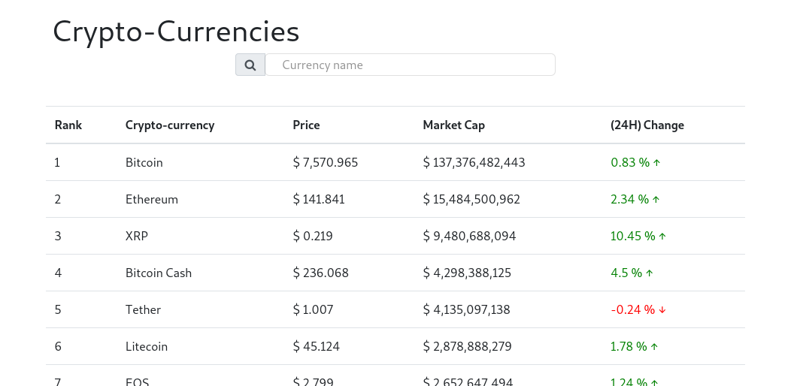
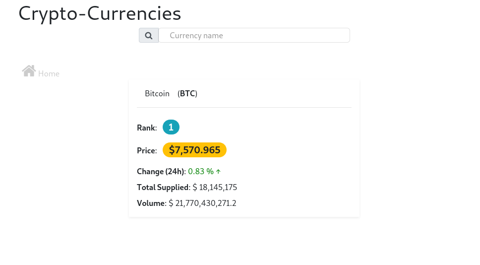
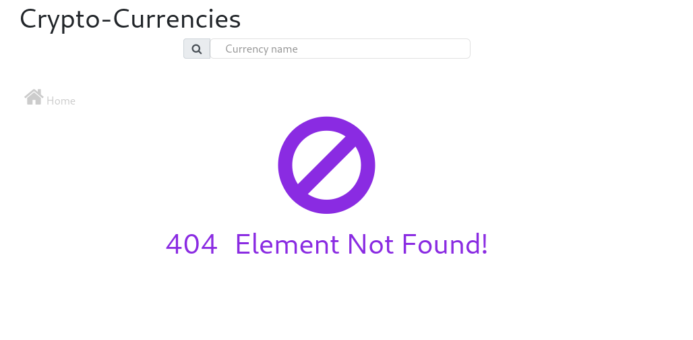
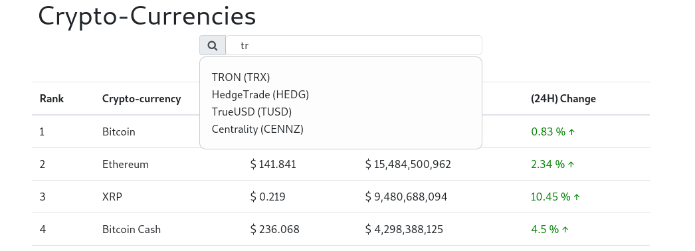

# Hands On ReactJs Framework

## Description
This project is an intermediate React project exercise for mastering all necessary concepts for modern Javascript application development.

## Technologies
* ReactJs (17.x)
* Express (4.17.x)
Hosted on Heroku.

## Screenshots
### Home
 

### Detail
Shows when a crypto-currency in the list is selected.

### Error (404)
Shows when an error occurred.

### Search feature
Search feature helps to quickly find and crypto-currency, through any sequence of letters.

## Credit
Backend API is proprietary of its owner [Udilia](https://udilia.com/docs/cryptocurrencies/v1).